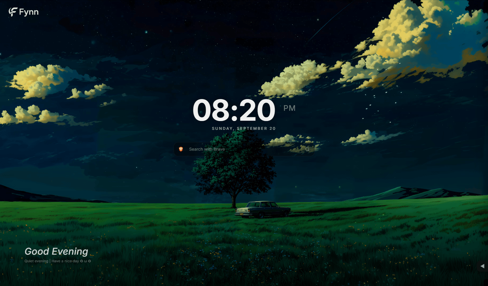
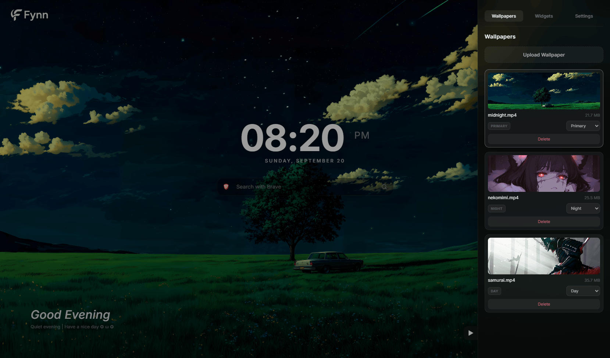

# Fynn New Tab

A customizable, cinematic new tab page for Brave and other Chromium browsers. Put an image or an MP4 video behind a clean clock, search bar and a few optional widgets.

Built with plain HTML, CSS and JavaScript (no framework, no build step) on Chrome Extension **Manifest V3**.

## Screenshots

| New tab | Dashboard |
| :---: | :---: |
|  |  |

## Features

- **Wallpapers** — JPEG, PNG, WebP or MP4 video, stored locally. Pin one, or let Day/Night wallpapers switch automatically (see [Wallpaper modes](#wallpaper-modes)).
- **Search** — switch between Brave Search and Google, with an optional dim/blur effect while typing.
- **Widgets** — Clock (12h/24h), Date, Greeting, Search and Notes (create, edit, pin, mark as done, delete). Each one can be toggled on or off.
- **Dashboard** — a slide-out panel with *Wallpapers*, *Widgets* and *Settings* tabs.
- **Private and offline** — no analytics, no accounts, and the page makes no network requests of its own. The only outgoing request is the search you submit. The Inter font is bundled, so nothing is loaded from a CDN.

## Install (unpacked)

The extension isn't on the Chrome Web Store, so you load it as an unpacked extension.

1. Get the code:
   ```bash
   git clone https://github.com/FynnML/Fynn-NewTab.git
   ```
   or download the ZIP from GitHub and extract it.
2. Open the extensions page:
   - Brave: `brave://extensions`
   - Chrome: `chrome://extensions`
3. Turn on **Developer mode** (top-right corner).
4. Click **Load unpacked** and select the folder that contains `manifest.json` (the repository root, **not** the `newtab/` folder).
5. Open a new tab.

**Updating:** run `git pull`, then click the reload icon on the extension's card in the extensions page.

**"Manifest file is missing or unreadable"** means the wrong folder was selected. Pick the one that directly contains `manifest.json`.

## Wallpaper modes

Open the dashboard (the ◀ button at the bottom of the right edge), go to **Wallpapers**, and use the dropdown on each wallpaper card. Every wallpaper has exactly one mode:

| Mode | What it does |
| --- | --- |
| **Primary** | Pinned. Always shown, at any time of day. Only one wallpaper can be Primary; choosing a new one turns the previous one back into Default. |
| **Day** | Shown from **06:00 to 17:59**. |
| **Night** | Shown from **18:00 to 05:59**. |
| **Default** | The fallback. Newly uploaded wallpapers start here. |

### Which wallpaper is shown?

The first rule that matches wins:

1. **Primary**, if one is set.
2. The **Day** or **Night** wallpaper that matches the current time.
3. A **Default** wallpaper.
4. The **built-in wallpaper** that ships with the extension (`assets/wallpapers/default.jpg`).

So *Primary* means "always this one", while *Day/Night* means "follow the clock".

### Typical setups

- **One wallpaper, always:** set it to **Primary**.
- **Automatic day/night cycle:** set one wallpaper to **Day** and another to **Night**, and make sure **no wallpaper is Primary**. A Primary wallpaper overrides the schedule.
- **Just try things out:** leave new uploads on **Default**.

### Good to know

- Times use your computer's local clock and are fixed at 06:00 and 18:00, not tied to sunrise or sunset.
- The wallpaper is re-checked every minute, so it changes on its own without reloading the tab.
- Keep **one wallpaper per mode**. If several share the same mode, only one of them is used, and which one is not guaranteed.
- The built-in wallpaper isn't listed in the dashboard and can't be deleted. It only appears when no custom wallpaper applies, for example on first run or after you delete all of yours.

## Your data

| What | Where |
| --- | --- |
| Wallpapers and notes | IndexedDB (wallpapers are saved as Blobs) |
| Settings, widget visibility and layout | `localStorage` |

The `unlimitedStorage` permission lets you keep large video wallpapers. **Reset settings** in the dashboard clears preferences only; your wallpapers and notes are kept. Uninstalling the extension removes all of its data.

## Project structure

```text
Fynn-NewTab/
├─ manifest.json
├─ newtab/
│  ├─ index.html
│  ├─ style.css
│  ├─ fonts.css          # @font-face for the bundled Inter font
│  └─ app.js
├─ assets/
│  ├─ fonts/             # Inter (self-hosted) + its OFL license
│  ├─ icons/             # search engine icons
│  ├─ images/            # Fynn logo and extension icon
│  └─ wallpapers/        # built-in default wallpaper (default.jpg)
└─ docs/
   └─ screenshots/
```

## Changing the built-in wallpaper

Replace `assets/wallpapers/default.jpg` with your own image. A compressed JPEG or WebP under a few hundred KB keeps the extension small. To use a different file name or format, update `DEFAULT_WALLPAPER_SRC` at the top of the wallpaper section in `newtab/app.js`. If the file is missing, the page falls back to a plain dark background.

## License

The code is released under the [MIT License](LICENSE).

The bundled [Inter](https://rsms.me/inter/) font is © The Inter Project Authors and is licensed under the [SIL Open Font License 1.1](assets/fonts/OFL.txt).
